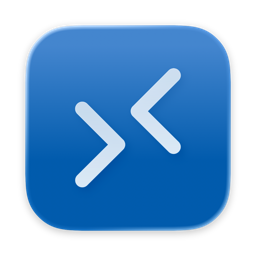
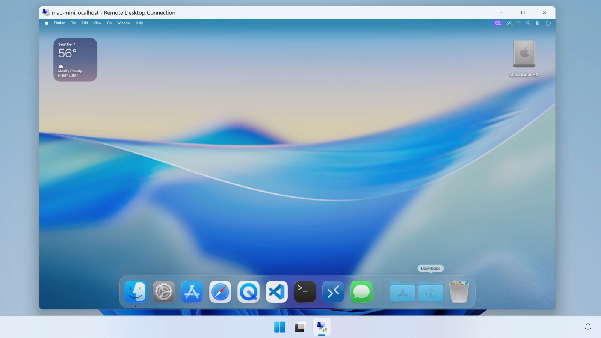

# ProRDP

**A native RDP server for macOS** 
Connect from Windows Remote Desktop, the Windows App, or FreeRDP and drive your Mac as if you were sitting at it.

[Website](https://prordp.app) · [Documentation](https://prordp.app/docs/) · [Release notes](https://github.com/prordp-app/release/releases) · [License](LICENSE)

Free for home + personal use

 

<picture>
  <source media="(prefers-color-scheme: dark)" srcset=".github/assets/screenshot-dark.png">
  <source media="(prefers-color-scheme: light)" srcset=".github/assets/screenshot-light.png">
  
</picture>

## Download

1. Open the [latest release](https://github.com/prordp-app/release/releases/latest) and download
   `ProRDP-<version>.dmg` from **Assets**.
2. Open the disk image and drag **ProRDP** into **Applications**.
3. Launch ProRDP. It lives in the menu bar, not the Dock.
4. Choose **Start**. macOS will ask for **Screen Recording** and **Accessibility** access. Grant
   both: without them the session connects but shows no picture and ignores your keyboard and mouse.
5. From another computer, point any RDP client at your Mac's name or address.

Every build is signed with a Developer ID and notarized by Apple, so it opens without Gatekeeper
warnings.

### Requirements

| | |
| --- | --- |
| **macOS** | 15 Sequoia or later |
| **Mac** | Apple silicon or Intel (universal app) |
| **Client** | Any standard RDP client: Windows Remote Desktop Connection (`mstsc`), the Windows App, FreeRDP |

## What you get

<table>
  <tr>
    <td width="50%" valign="top">
       
      <b>End to end hardware encoding</b> 
      Capture and encode run on the GPU and the media engine through VideoToolbox, so your CPU
      never touches raw pixels.
    </td>
    <td width="50%" valign="top">
       
      <b>Flexible resolutions and scaling</b> 
      Connect to a headless virtual display created at the client's exact resolution, without any stretching, scaling, or black bars.
    </td>
  </tr>
  <tr>
    <td valign="top">
       
      <b>Built for Windows RDP</b> 
      Stock Windows Remote Desktop connects with default settings: no <code>.rdp</code> edits, no
      plugin, no companion app.
    </td>
    <td valign="top">
       
      <b>Fully local. No cloud accounts.</b> 
      Direct connections within your network. No relay, no account, no telemetry.
    </td>
  </tr>
  <tr>
    <td valign="top">
       
      <b>Clipboard and files</b> 
      Copy text, rich text, images, and files between the Mac and the client, in either direction.
    </td>
    <td valign="top">
       
      <b>Sound comes with you</b> 
      The Mac's audio plays on the client while you're driving it remotely.
    </td>
  </tr>
  <tr>
    <td valign="top">
       
      <b>A pointer that feels attached</b> 
      Your client draws the cursor locally, so it tracks your hand rather than the network, and
      always shows the right shape.
    </td>
    <td valign="top">
       
      <b>Adaptive performance</b> 
      Real time tuning of your frame rate, bit rate, and compression to ensure the best possible performance.
    </td>
  </tr>
</table>

## License at a glance

This is a summary. The [LICENSE](LICENSE) file is what applies.

| ✅ Free for personal use (no commercial license needed) | ❌ Needs a commercial license |
| --- | --- |
| Reaching your own Mac from home or on the road | Using it on a work-owned or managed Mac |
| Hobby projects, learning, tinkering | Supporting or administering an organization's computers |
| Any number of Macs you personally own | Paid work, including freelance and contract work |
| | Building it into a product or service for others |

Please don't re-host the download. Link to this page or to [prordp.app](https://prordp.app) instead.

## Help and feedback

- **Docs:** [prordp.app/docs](https://prordp.app/docs/)
- **Bugs and feature requests:** [open an issue](https://github.com/prordp-app/release/issues)
- **Everything else, including business licensing:** [hello@prordp.app](mailto:hello@prordp.app)

This repository holds release builds only. Each release is published here automatically from the
ProRDP source, which is not public.

 
© 2026 ProBit LLC. ProRDP is free for personal use and not licensed for business or enterprise use.

